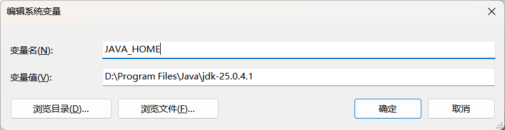
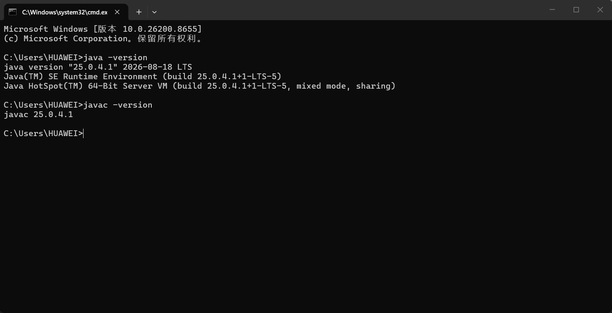
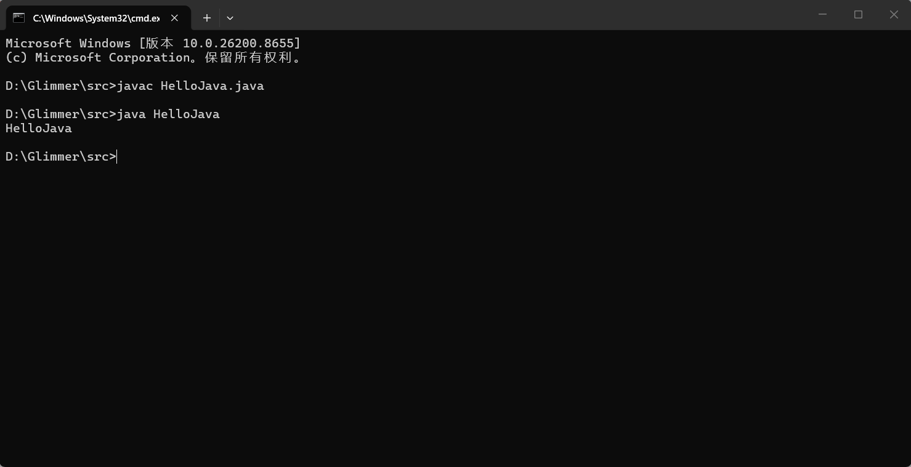

### 后端任务一

## Task 1

### 1. JDK,JRE,JVM的定义和关系：

JDK包含JRE,JRE包含JVM

-**JDK** 是java开发的工具包，包含了JRE和java的开发工具，开发和编译java源代码必须安装JDK

-**JRE **是java运行环境，仅仅用于运行编译好的程序

-**JVM **是java的运行载体，用以执行class字节码文件

### 2.为什么装好这些工具后，JAVA程序可以被编译和运行：

JDK内部自带编译器和运行工具，同时还内置了JRE和JVM

### 3.安装JDK，记录版本号

### 4.

## Task 2

### 1.配置了哪些环境变量及他们的作用

-JAVA_HOME

指向JDK的安装根目录，让其他软件找到JDK的位置，方便后续作业

-Path

让系统可以找到java.exe,javac.exe这两个命令程序

### 2.为什么配置完成后可以在命令行就可以直接识别 java javac

当windows系统在命令行输入一条命令时，会去Path环境变量里面记录的文件夹里查找程序，配置完成后，系统可以找到 java.exe javac.exe 所在的bin目录

### 3.

### 4. java javac 的作用

-javac 是java编译器，读取后缀为.java 的源代码文件，检查代码语法是否有错误，只有没有错误时会生成 .class 字节码文件，该文件是给JVM看的

-java 是启动程序，负责启动JVM并且加载已经编译好的 .class 字节码文件，调用 main ,执行程序

## Task 3

下面是一段单文件 Java 代码

package com.Example;

import com.Example.tool.Print;

public class HelloWorld {
    public static void main(String[] args) {
        Test.test();
    }
}

class Test {
    public static void test() {
        Print.print("Hello World");
    }
}

### 1.大致分为几个部分 每个部分的作用

-1. package com.Example;    设置类所属于的包，用来整理 管理文件

-2. import com.Example.tool.Print;    导入语句，可以在写代码时直接使用

-3.  public class HelloWorld {}    定义一个类“HelloWorld”

-4.  public static void main(String[] args)   入口

-5.    class Test {
    public static void test() {
        Print.print("Hello World");
    }

调用Test 类中静态的test()方法 执行代码，最终在控制台打印

### 2.什么是包(package),为什么需要包结构

包是一种文件夹，用来组织管理多个类，使用它可以让项目管理更加清晰有条理

### 3.import的作用

当要使用其他包中的类时，用import 导入，可以让代码更加简洁，不用每次都打完整的名称

### 4. main 方法为什么能作为程序入口

public static void main(String[] args)   通过这一句让JVM自动寻找到main作为程序入口

### 5.

## Task 4

