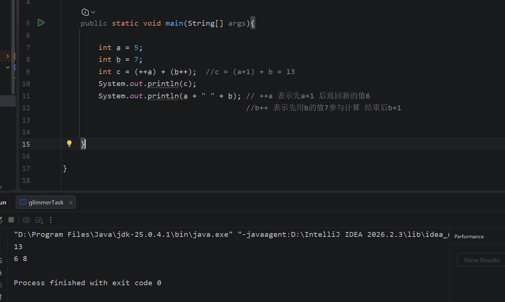

# Task1.数据类型与运算基础

### 1.Java的八种基本数据类型有:

整型：byte short int long

浮点型： float double

字符型：char

布尔型：boolean

### 2. 

byte 占一字节 表示范围：-2^7  到  2^7 -1

short 占两字节 表示范围：-2^15  到  2^15 -1

int 占四字节 表示范围： -2^31 到  2^31 -1

long 占八字节 表示范围： -2^63  到  2^63 -1

### 3.基本类型与引用类型区别

基本类型：变量直接存储数值，保存在栈内存

引用类型：变量保存的是一个地址，保存在堆内存

### 4.

隐式类型转换

### 5.

b=52

a = 4

c被赋值为0这个字符，0这个字符对应的数字是48

int b = a + c

发生隐式类型转换。将字符转换为数字，故 b = 48 +4 =52

### 6.

###  7.为什么两个正数相加结果可能为负数

当两个正数相加结果的数值过大时，超出了int能保存的最大值，就会发生*整数溢出*现象，可能把符号位从0变成1，从而产生负数

### 8.float精度问题

float是单精度浮点数，当在计算机中用二进制储存数据时，无法精确表示十进制小数，会出现误差

# Task2 控制流与基础算法

